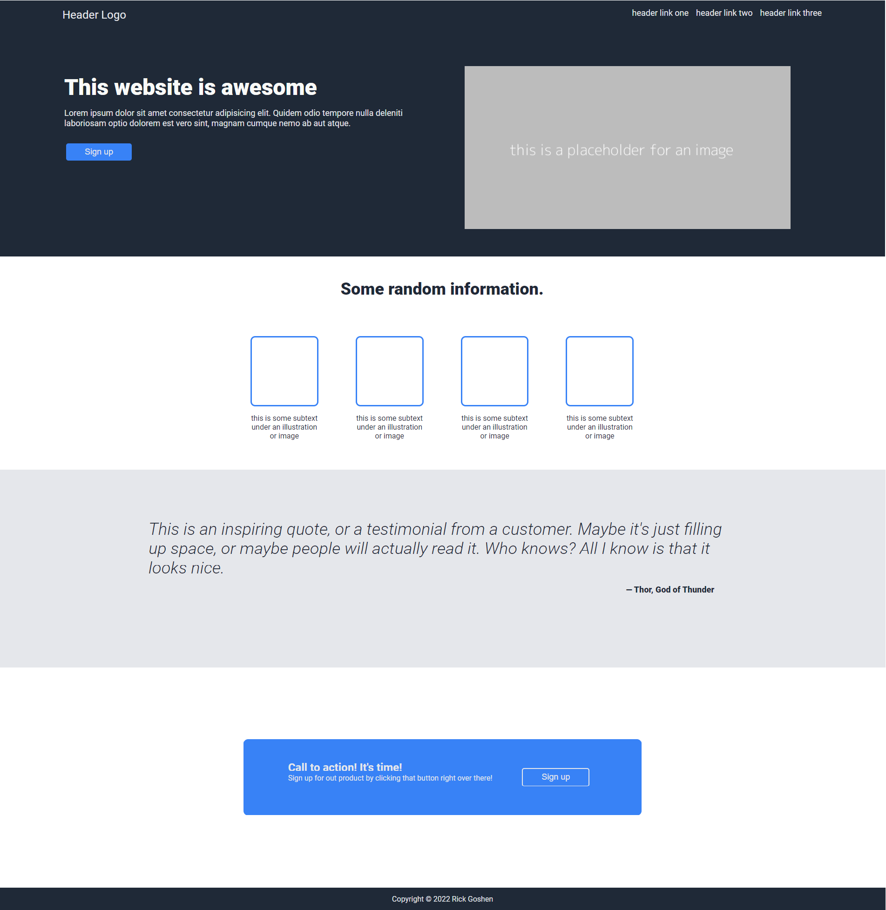

# Flex Landing Page

[Live Page](https://rgoshen.github.io/odin-landing-page/)

## Table of Contents

- [About](#about)
- [Getting Started](#getting_started)

## About <a name = "about"></a>

This is a simple landing page using HTML and CSS flexbox. The page is divided into 4 main sections consisting of hero, information, quote and call to action.



## Getting Started <a name = "getting_started"></a>

These instructions will get you a copy of the project up and running on your local machine for development and testing purposes.

### Installing

Clone the repo or download the zip file.

```
git clone https://github.com/rgoshen/odin-landing-page
```
